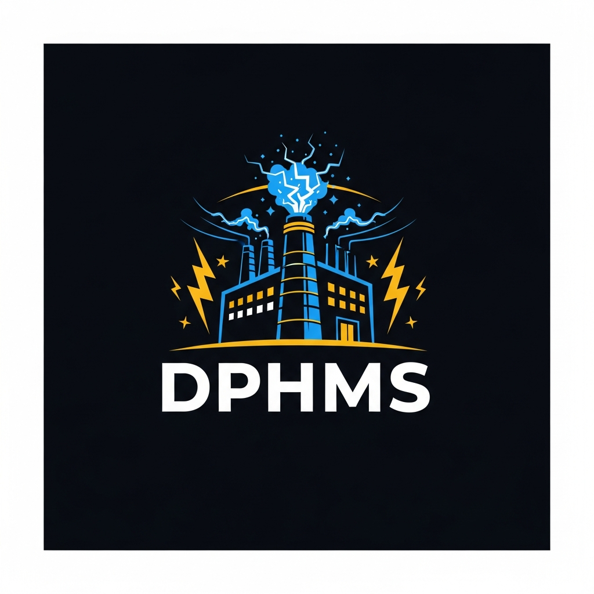

# Richard Carmen Anicola

### DPHMS — Digital Power House Media Studios

*Building powerful Android applications and security tools*

---

## Apps

### Secure Guard
> Military-grade Android security suite for BLU G64

Virus scanner • App manager • ADB terminal • Shizuku integration • DNS-VPN • Custom ROM finder

---

### The Arbiter's Grammar
> 30 laws of manipulation and control — recognize the tactics used against you

---

### BRINGWAR Gaming Rewards
> Earn and redeem rewards across BRINGWAR games

---

### Secure Guard Threat Database
> Live spyware, bloatware, and malware definitions

---

*© 2026 DPHMS — Digital Power House Media Studios*

